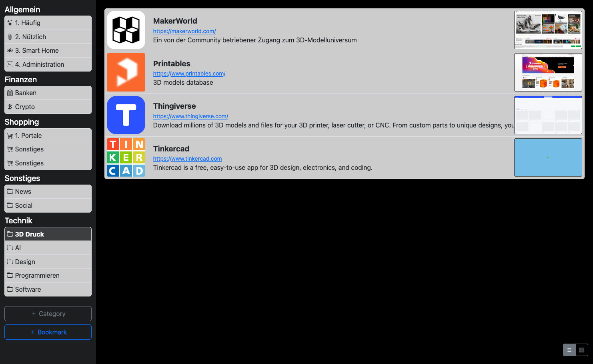

# phpSimpleBookmark

A lightweight, self‑hosted bookmark manager for local web servers (e.g. Synology, QNAP, UGreen, Raspberry Pi).

The application stores all data in a local JSON file – no database required. Images (favicons, previews) are stored in subfolders.

---

## ✨ Features

* Simple bookmark management via a nice web UI
* Automatically grabs **title**, **description**, and **favicon** from the URL  
(if title or desciption is empty while creating or modifing the entry)
* Drag & drop bookmarks between categories
* Optional preview images (manual or automated)

---

## 🧩 Optional Features

* Support for an external **screenshot server** (see `/server`) to generate preview images automatically

---

## ⚠️ Security Warning

This project is intentionally minimal and **does not include security checks**.

**Use only in a trusted local network.**

Important implications:

* URLs can point anywhere (including phishing sites)
* JavaScript in URLs **will be executed** when clicked  
(e.g. javascript:alert('TEST'); as URL will show the message TEST.)

Do **not** expose this application to the public internet.

---

## 🚀 Installation

1. Copy all files from the `src` directory into any directory within your web server’s document root (e.g. `htdocs`, `www`).
2. Ensure the following are writable by the web server:

   * `uploads/` directory
   * `backups/` directory

That’s it – no database setup required.

_Important!_ If you upgrade from older version, the data.json had been moved into the backups folder (less write permissions needed).

---

## 👥 Multi‑User Setup (Optional)

For multiple users, simply duplicate the entire application into separate folders.

You may secure each instance using **HTTP Basic Authentication** of your webserver.

---

## 🗂 Categories & Usage Notes

### Category Structure

Category titles consist of two parts separated by `/`:

```
TopCategory/SubCategory
```

* The **prefix** represents the top‑level category
* The **suffix** represents the subcategory
* When adding or modifying a bookmark, the current top category is automatically used as the prefix
* To move a subcategory, manually add the desired prefix (with the `/`) when editing

### Category of Bookmarks

* Bookmarks can be moved between subcategories via drag & drop

### Images

* Icons and preview images can be set manually while editing
* Simply drag & drop an image file onto the corresponding field

---

## 🖼 Example Screenshot



---

## 📄 License & Disclaimer

This project is provided as‑is, without warranty of any kind. Use at your own risk.
